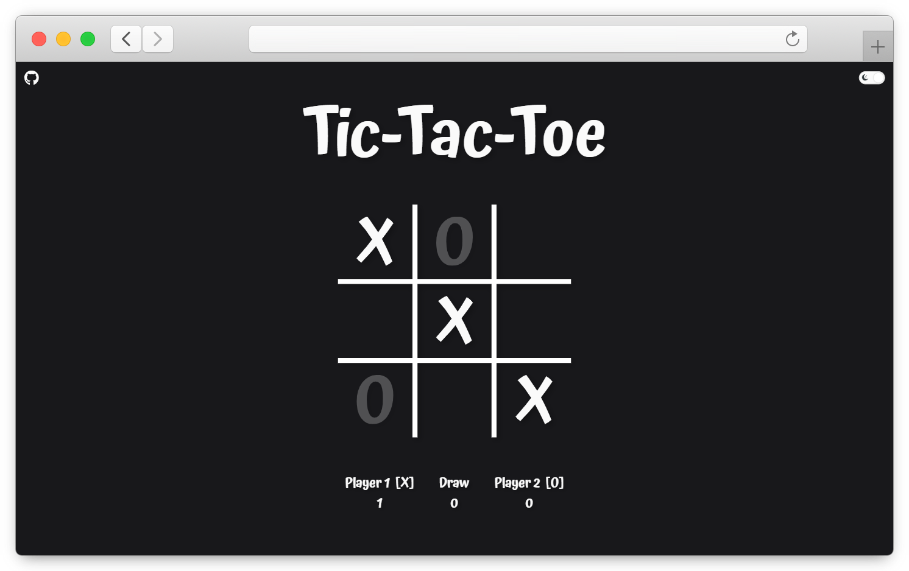

<!-- APPLICATION PREVIEW -->
<div align="center">
  
  
  
</div>

<!-- SHIELDS -->
<div align="center">
  
  
  
  [](https://github.com/lszymanski7/tic-tac-toe/blob/main/LICENSE.md)
  
  
  
  
</div>

<br/>

<!-- TIC-TAC-TOE -->
# Tic-Tac-Toe
Tic-tac-toe is one of the most famous strategy games in the world. It's played by two players on a three-by-three board. Each of them aims to win by marking three squares in one line with the same symbol - X or O. This application is an implementation of this game and allows you to play with your friends without using paper and pencil.

🚀 **Live demo:** <a href="https://lszymanski7-tic-tac-toe.netlify.app">https://lszymanski7-tic-tac-toe.netlify.app</a>

<!-- TABLE OF CONTENTS -->
## Table of Contents
1. [Game Rules](#game-rules)
2. [Features](#features)
3. [Technologies](#technologies)
4. [Getting Started](#getting-started)
    - [Prerequisites](#prerequisites)
    - [Installation](#installation)
    - [Application](#application)
5. [Contributing](#contributing)
6. [License](#license)

<!-- GAME RULES -->
## Game Rules
The game is played on a three-by-three board. Two players take turns marking empty squares with their symbol - X or O. In each game, the first move belongs to a different player to even the odds of winning. If one of the players marks three squares in a line with his symbol, that player wins. The game also ends when all the squares are marked and no one has a winning combination (Fig. 1.) - then it's a draw.

<div align="center">

  

  **Fig. 1.** All winning combinations (horizontal, vertical and diagonal).

</div>

<!-- FEATURES -->
## Features
- Changing the starting player after each completed game.
- Highlighting a player's turn in red (X or O).
- Displaying an animation when someone wins or it's a draw.
- Counting the game score and resetting it after refreshing the page.
- Saving data to localStorage.
- Toggling between light and dark theme.

<!-- TECHNOLOGIES -->
## Technologies


[](https://sass-lang.com)
[](https://reactjs.org)
[](https://webpack.js.org)
[](https://babeljs.io)
[](https://jestjs.io)
[](https://testing-library.com)
[](https://nodejs.org/en)
[](https://npmjs.com)
[](https://expressjs.com)
[](https://eslint.org)
[](https://prettier.io)

All technologies and tools were used in the latest version at the time of creating this project.

<!-- Getting Started -->
## Getting Started

<!-- Prerequisites -->
### Prerequisites
> **Note** Download [Node.js](https://nodejs.org/en/download) installer.

This project was created with the Node.js (v18.9.0) runtime environment and the NPM (v8.19.1) for package management. Use the Node.js installer to install both of them on your system.

<!-- Installation -->
### Installation
Follow all of the steps below to get a local copy of the project and install any dependencies required to run it.

1. Clone the repository.

```
$ git clone https://github.com/lszymanski7/tic-tac-toe.git
```

2. Navigate to the project directory.

```
$ cd tic-tac-toe
```

3. Install all dependencies.

```
$ npm install
```

<!-- APPLICATION -->
### Application
To run the application, you must first create a production build. Use the command below for this purpose.

```
$ npm run build
```

The next command starts the server built with Node.js and Express. All static files generated by webpack will be served from the `./build` folder. The application will be launched at the following url: [http://localhost:3000](http://localhost:3000)

```
$ npm run start
```

<!-- CONTRIBUTING -->
## Contributing
Any contributions are greatly appreciated. Use the [issue tracker](https://github.com/lszymanski7/tic-tac-toe/issues) if you want to report bugs, request a new feature or improve documentation. Please check for existing issues before you report them yourself.

You can contribute by following these steps:
1. Fork this repository on GitHub.
2. Clone the forked repository to your machine: `$ git clone https://github.com/username/tic-tac-toe.git`
3. Create a new branch: `$ git switch -c <branch-name>`
4. Make necessary changes and commit them.
5. Push changes to GitHub: `$ git push origin -u <branch-name>`
6. Submit a new Pull Request on GitHub.

<!-- LICENSE -->
## License
This project is licensed under the terms of the [MIT License](https://github.com/lszymanski7/tic-tac-toe/blob/main/LICENSE.md).

<br/>

<!-- LINKS -->
##
<div align="center">
  <p>If you have any questions or suggestions, please send me an <a href="mailto:lszymanskiinfo@gmail.com?subject=GitHub - Your subject here...">e-mail</a>. <br/> You can also find me on the following websites:</p>
  
  [](https://stackoverflow.com/users/18706083)
  [](https://gitlab.com/lszymanski7)
  [](https://linkedin.com/in/lszymanski7)
</div>
